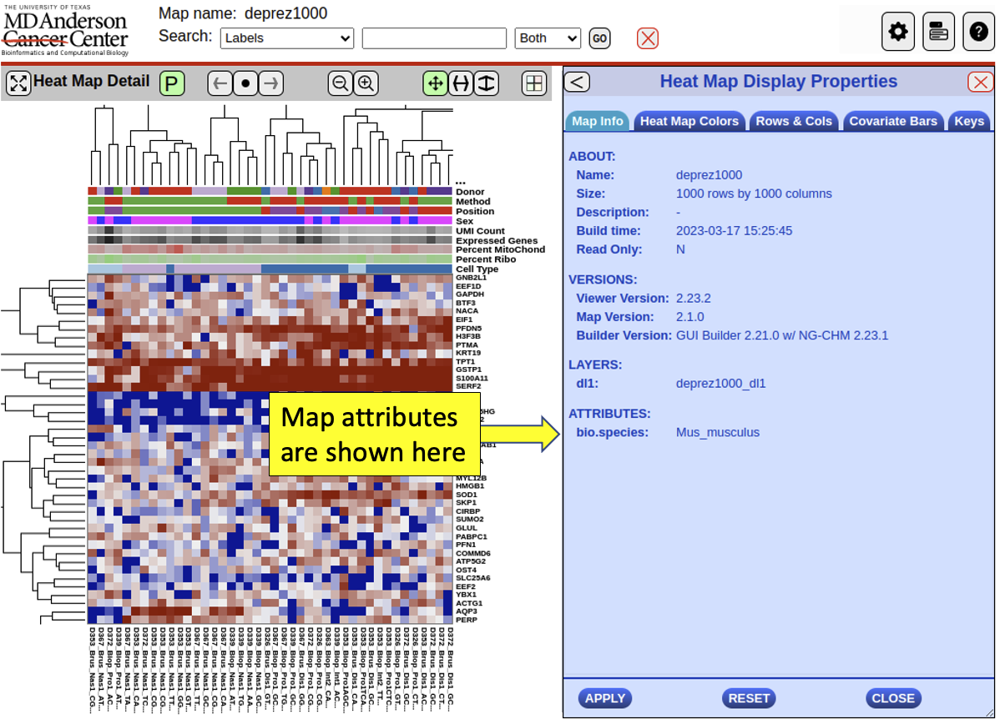

# Writing Linkouts

The NG-CHM linkout system provides linkouts from NG-CHMs and similar objects to relevant web resources.  Important considerations in the design of the linkout system include:

* Wherever possible, linkouts aren't specific to NG-CHMs but should be usable from any "source object" with roughly comparable features.

* Linkouts are not directly incorporated into NG-CHMs.  Available linkouts change over time, and can vary from site to site. An NG-CHM should not have to be rebuild/edited because the available linkouts changed.

## Target Audience

This document describes how NG-CHMs can be customized using linkouts and plugins.  The reader is assumed to be familar with NG-CHMs and able to write Javascript programs.

## Accessing the Linkout API

`window.linkouts` provides the core API to the NG-CHM agnostic linkout functions.

## Linkout Categories


<br clear="left"/>
*Hamburger* linkouts apply to the entire NG-CHM (or other object), not to any specific part of it.  They are visible to users in a global "Gear-" or "Hamburger"-type menu. In NG-CHMs, for example, they are shown at the bottom of the Hamburger menu (see figure).  Hamburger linkouts are defined using `linkouts.addHamburgerLinkout`.


*Panel* plugins are a way to integrate interactive external tools with NG-CHMs.

<br clear="left"/>
Examples are our scatter plot and pathway plugins. In NG-CHMs, as shown in the figure, Panel plugins are available to users in the panel drop-down menus.  When selected, panel linkouts display content and interact with the user in the panel's iframe. They are defined using `linkouts.addPanePlugin`.

*Single-axis* label linkouts enable the user to access directly external resources about either row or column labels, typically by opening an external web page.

<br clear="left"/>
In NG-CHMs, matching single-axis linkouts are included in the row and/or column label menus.  Linkouts to a specific label are included in the top part of the menu. Linkouts to groups of labels are included in the bottom part of the menu.

*Two-axis* label linkouts, aka *matrix linkouts*, enable the user to access external resources for combinations of row and column labels.

<br clear="left"/>
In NG-CHMs, they are included in the Matrix Menu.

Both Single-axis and Two-axis label linkouts are defined using `linkouts.addPlugin`.  They can belong to one of two subcategories: *single-label* linkouts, denoted by `linkouts.SINGLE_SELECT`, or *multiple-label* linkouts denoted by `linkouts.MULTI_SELECT`.  

When defining a label linkout, you specify the type(s) (described directly below) of label(s) that the linkout applies to, as well as any attributes that it requires. A label linkout is included in a menu only if the NG-CHM has the linkout's required attributes and the type(s) of the NG-CHM's axis/axes match those of the linkout.

## Linkout Types

Linkout types are strings in dot-like notation, and (along with optional attributes described directly below) determine which axis linkouts are to be included in the menus. For example `bio.gene.hugo` represents HUGO gene symbols, `bio.gene.entrezid` represents NCBI Entrez Gene Identifiers, etc.

Types beginning with "chm." are reserved for definition by the NG-CHM system.  Types beginning with "bio." are reserved for types in Biology.

## Attributes


<br clear="left"/>
Attributes are string values globally associated with the NG-CHM.  For instance, the `bio.species` attribute can be used to specify the species to which all data in the NG-CHM applies. They are displayed in the Map Info tab of the Heat Map Display Properties dialog.

Map attributes are defined when building the NG-CHM.  In the NG-CHM Builder, they can be edited on the Format Heat Map page, Labels and Attributes task, with Show Advanced Features checked. In the NG-CHM R package, they are added with the `chmAddProperty` function.

## Label Linkout Targets

Label linkouts typically open a browser tab/window on a URL that is constructed by a short javascript function.
The constructed URL includes the label(s) passed to the linkout function.  Ideally, the base of the URL is a defined API provided by the linked resource that is not access restricted.

In a variation of this approach, the javascript function first queries an API for information about the passed label(s) and uses information in the
result to construct the URL to open.

Note that for `MULTI-SELECT` linkouts, large selections can easily result in document URLs or APIs that exceed the maximum URL length.  Several alternatives to including all of the
labels in the URL are possible but all require the owner of the linked resource to provide a suitable access method.

We have noted three types of URL/API:

* APIs that include the label(s) as query parameters: for example, `https://base-url-for-linkout/?gene=TP53`.

* APIs that include a label as an element of the URL: for example, `https://base-url-for-linkout/gene/TP53`.

* APIs that include the label(s) after a hash symbol: for example, `https://base-url-for-linkout/#/gene/TP53`.

All three URL types open a new tab/window without issues.  However, the third type does not automatically reload an existing tab/window.  The browser will update the tab's URL but the page content doesn't update.  We've found that including a random query parameter before the hash will force the page to update:

* Better API for including the label(s) after a hash symbol: `https://base-url-for-linkout/?_=a-random-string#/gene/TP53`.

## Structure of a typical `custom.js` file

In NG-CHMs, all linkouts are gathered into a single javascript file, customarily called `custom.js`.  It's usually organized as detailed below.

### Set version number

Call `linkouts.setVersion` to define the custom.js file version.  In NG-CHMs, the linkouts version is displayed with other version numbers in the About dialog.

```javascript
linkouts.setVersion('1.0.0');
```

### Describe types

`linkouts.describeTypes` should be used to provide more information about the linkout types used in the custom.js file. For example:

```javascript
linkouts.describeTypes([
  { typeName: 'bio.gene.hugo',
    displayName: 'HUGO gene symbol',
    description: 'The official HUGO symbol for a gene',
    examples: 'TP53',
    format: 'Latin letters and Arabic numerals, usually without punctuation',
    },
  ]);
```

NG-CHMs currently don't display this additional type information. The NG-CHM Builder uses `displayName` in drop-down menus for selecting row and column types. We anticipate displaying and using more of this information in future releases.  In any case, it can be a handy reference for linkout developers.

### Specify type relations (optional)

You can specify that one type is a subtype of another, for instance:

```javascript
linkouts.addSubtype('bio.gene.hugo', 'bio.pubmed');
```

This specifies that `'bio.gene.hugo'` is a subtype of `'bio.pubmed'`. This means that pubmed linkouts automatically apply to labels that are specified as HUGO gene symbols.

### Specify Linkouts

Hamburger and label linkouts typically require helper functions. They should be enclosed in blocks or immediately-executed function expressions (IIFEs) to prevent pollution of the window namespace.

For example:

```javascript
(function (linkouts) {

    const baseURL = 'https://www.ncbi.nlm.nih.gov/';

    function openEntrezIdPage(entrezIds) {
        const id = entrezids[0];
        linkouts.openUrl(baseURL + 'gene/' + id, 'NCBI');
    }

    linkouts.addPlugin({
        name: 'NCBI',
        description: 'Adds linkout to NCBI',
        version: '0.0.1',
        site: baseURL,
        logo: baseURL + 'portal/portal3rc.fcgi/4013172/img/3242381',
        linkouts: [
            { menuEntry: 'View NCBI Entrez ID',
              typeName: 'bio.gene.entrezid',
              selectMode: linkouts.SINGLE_SELECT,
              linkoutFn: openEntrezIdPage,
            },
          ],
      });
}) (linkouts);
```
The linkout will be added to the row label menu if the rows are identifed as Entrez identifiers, and/or to the column label menu if the columns are identified as Entrez identifiers.

There is an additional parameter for matrix menu entries. See `linkouts.addPlugin` for details.

## Linkouts API: Constants

### :atom_symbol: `linkouts.SINGLE_SELECT`

Specifies a linkout that accepts a single label.

### :atom_symbol: `linkouts.MULTI_SELECT`

Specifies a linkout that accepts one or more labels.

## Linkouts API: Functions

### :atom_symbol: `linkouts.addHamburgerLinkout`

Adds the hamburger linkout specified by params.

```javascript
linkouts.addHamburgerLinkout(params);
```

params is an object with the following fields:
<dl>
<dt>name</dt><dd>Internal name of the linkout</dd>
<dt>label</dt><dd>Shown in menu entries etc.</dd>
<dt>icon</dt><dd>URL for a small image (icon) to show in the menu entry</dd>
<dt>action</dt><dd>Function executed when the plugin is selected. No arguments are passed to the function.</dd>
</dl>

### :atom_symbol: `linkouts.addPanePlugin`
Add the panel plugin specified by plugin.

```javascript
linkouts.addPanePlugin(plugin);
```

plugin is an object with the following fields:
<dl>
<dt>name:</dt><dd>Name of the plugin (a string). Used in menus etc.</dd>
<dt>helpText:</dt><dd>Brief help text. Used in tooltips etc.</dd>
<dt>src:</dt><dd>URL of page to open in the panel. Page must implement the panel plugin protocol.</dd>
<dt>params</dt><dd>An object specifying the panel's parameters. To be documented.</dd>
</dl>

### :atom_symbol: `linkouts.addPlugin`
Either adds the plugin specified by plugin or replaces an existing plugin with the same name.

```javascript
linkouts.addPlugin(plugin);
```

`plugin` is an object with the following fields:

<dl>
<dt>name</dt><dd>The plugin's name</dd>
<dt>description</dt><dd>A short description of the plugin.</dd>
<dt>version:</dt><dd>Version of the plugin.</dd>
<dt>site:</dt><dd>URL for site related to the plugin</dd>
<dt>logo:</dt><dd>URL for logo related to the plugin</dd>
<dt>linkouts:</dt><dd>An array of axis linkouts. See below.</dd>
<dt>matrixLinkouts:</dt><dd>An array of matrix linkouts. See below.</dd>
</dl>

Each element of the `linkouts` field is an object with the following fields:

<dl>
<dt>menuEntry</dt><dd>Menu entry for the linkout.</dd>
<dt>typeName</dt><dd>Type of labels expected by the linkout.</dd>
<dt>selectMode</dt><dd>Either `linkouts.SINGLE_SELECT` or `linkouts.MULTI_SELECT`</dd>
<dt>linkoutFn</dt><dd>Function called when the linkout is selected. It is passed a string array. If `selectType == linkouts.SINGLE_SELECT` the array will contain one element.</dd>
<dt>attributes:</dt><dd>An array of attributes (strings) that this linkout requires. Defaults to none.</dd>
</dl>

Each element of the `matrixLinkouts` field is an object with the following fields:

<dl>
<dt>menuEntry</dt><dd>Menu entry for the linkout.</dd>
<dt>typeName1</dt><dd>Type of labels on one axis expected by the linkout.</dd>
<dt>typeName2</dt><dd>Type of labels on the other axis expected by the linkout.</dd>
<dt>selectMode</dt><dd>Either `linkouts.SINGLE_SELECT` or `linkouts.MULTI_SELECT`</dd>
<dt>linkoutFn</dt><dd>Function called when the linkout is selected. It is passed an object with two entries (`Row` and `Column`), each of which is an array of strings. If `selectType == linkouts.SINGLE_SELECT`, each array will contain one element.</dd>
<dt>attributes:</dt><dd>An array of attributes (strings) that this linkout requires. Defaults to none.</dd>
</dl>

### :atom_symbol: `linkouts.describeTypes`
Describe an array of type strings.

```javascript
linkouts.describeTypes(typearray);
```

`typearray` is an array of objects, each of which includes the following fields:
<dl>
<dt>typeName:</dt><dd>The type (a string).</dd>
<dt>displayName:</dt><dd>Display name for the type. Used in menus etc.</dd>
<dt>description:</dt><dd>A longer description of the type.</dd>
<dt>examples:</dt><dd>One or more example values.</dd>
<dt>format</dt><dd>A description of the format of acceptable values of the type.</dd>
</dl>

### :atom_symbol: `linkouts.getAttribute`
Returns the value of the global attribute specified by attribute (a string).
Returns undefined if no such attribute is defined.

```javascript
const value = linkouts.getAttribute(attribute);
```

### :atom_symbol: `linkouts.getMapFileName`
Returns the name of the file or other resource from which the NG-CHM or other source object was loaded. May or may not resemble the map's name.

```javascript
const fileName = linkouts.getMapFileName();
```

### :atom_symbol: `linkouts.getMapName`
Returns the name of the NG-CHM or other source object.

```javascript
const name = linkouts.getMapName();
```

### :atom_symbol: `linkouts.getSourceObjectType`
Returns the type (a string) of the source object. Returns `'chm'` for NG-CHMs.

```javascript
const objectType = linkouts.getSourceObjectType();
```

### :atom_symbol: `linkouts.getSourceObjectUniqueId`
Returns a unique identifier (a string) for the source object.

```javascript
const uniqueId = linkouts.getSourceObjectUniqueId();
```

### :atom_symbol: `linkouts.getVersion`
Returns the version string of the linkouts file (as set by `linkouts.setVersion`)

```javascript
const version = linkouts.getVersion();
```

### :atom_symbol: `linkouts.openUrl`
Opens the specified URL. If a linkouts panel is open, it will be opened in an iframe in that panel.  Otherwise it will be opened in a (new) window called name.

```javascript
linkouts.openUrl(URL, name, options)
```

options is an object with the following optional field:
<dl>
<dt>noframe:</dt><dd>If truthy, do not open in a linkout panel. Needed for sites that do not permit being opened in an iframe.
</dl>

### :atom_symbol: `linkouts.setVersion`
Sets the version string of the linkouts file to version (a string).  If called multiple times, the additional calls simply overwrite previous versions.

```javascript
linkouts.setVersion(version);
```

### :atom_symbol: `linkouts.simplifyLabels`
Combines the unique labels from the `Row` and `Column` entries of `labels` into a single string array.

```javascript
const allLabels = linkouts.simplifyLabels(labels);
```

